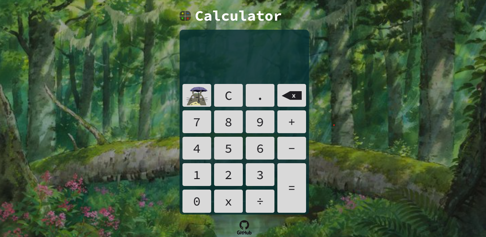

<h1 align="center"> Calculator 🔢</h1>

Project created to train and develop new habilities in JavaScript and CSS 

  <a href="#-technologies">Technologies</a>&nbsp;&nbsp;&nbsp;|&nbsp;&nbsp;&nbsp;
  <a href="#-project">Project</a>&nbsp;&nbsp;&nbsp;|&nbsp;&nbsp;&nbsp;
  <a href="#-possible-changes">Possible changes</a>&nbsp;&nbsp;&nbsp;|&nbsp;&nbsp;&nbsp;
  <a href="#memo-license">License</a>

  

 

  

## 🚀 Technologies

Esse projeto foi desenvolvido com as seguintes tecnologias:

- HTML
- CSS
- JavaScript
---
## 💻 Project

The project is a simple calculator which makes addition, subtraction, division and multiplication operations. The layout is inspired by the Studio Ghibli theme, and it's possible to change the background of the page pressing the Totoro's icon. 

- [Visit the project online](https://nathaliabeatriz.github.io/simple-calculator/)
---
## 🔖 Possible changes

- Add new funcionalities turning it into a scientific calculator.

Please fell free to contributte for this project.

---

## :memo: License

This project is under the MIT License

---
